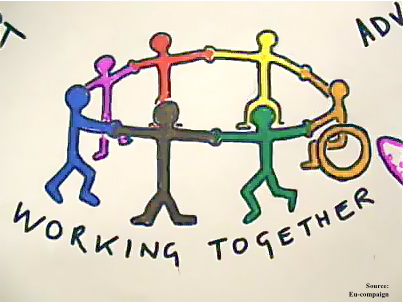
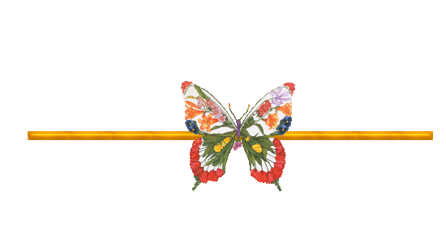

<section style="color:blue;float:left;padding-right:15px;">

</section>

<section style="color:blue;float:left;padding-right:20px;">
Najla?
</section>
<section>
**- Love coding with Python, R and sometimes Java.**  
**- Fun of Dockerization and Virtualization.**  
**- Attentive to new technologies for web developpement and design.**  
**- Highly interested in new data challlenges : big data, data sharing and cloud computing.**  
</section>

 
 

<section style="color:blue;float:left;padding-right:20px;">

 Citations:

</section>
 
<blockquote>
<citation> - When the going gets tough, the tough get going. _[*]</citation>    

<citation> - The pen is mightier than the sword. _[*]</citation>    

<citation> - An adventure is only an inconvenience rightly considered. An inconvenience is only an adventure wrongly considered. _[G.K. Chesterton]</citation>   

<citation> - We can not solve our problems with the same level of thinking that created them. _[*]</citation> 
     
<citation> - Science is the father of knowledge, but opinion breeds ignorance. _[Hippocrates]</citation>      

<citation> - The most important thing a professor can do is to make students feel that all the ideas were their own. _[Marvin Minsky]</citation>      

<citation> - Never discourage anyone who makes continual progress, no matter how slow._ [*]</citation> 

<citation> - You say I dream too big. I say you think too small._[*]</citation> 

<citation> - It's not what you know, it's when you know it._[*]</citation> 

<citation> - What gets us into trouble is not what we don’t know. It’s what we know for sure that just ain’t so. _[Mark Taiwan]</citation> 

<citation> - When you talk, you're only repeating what you already know. If you listen, you may learn something new._[Dalai Lama]</citation> 

<blockquote>
<section style="color:green;float:left;padding-right:20px;tiny;">
* :Some one said it.
</section>